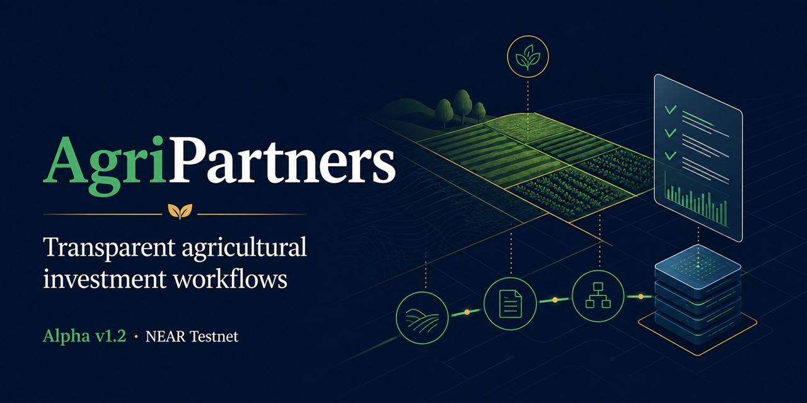

# AgriPartners

Transparent agricultural investment workflows on NEAR Protocol.

AgriPartners is an **Alpha-stage working prototype** for reviewing agricultural opportunities,
recording operating progress, and improving investor reporting and treasury visibility.

> AgriPartners does not accept live investments. The current product is a Testnet demonstration,
> not a production custody, payout, settlement, or Mainnet investment service.



## Explore

- [Open the live product](https://agripartners.vercel.app/#home)
- [Start Presentation Mode](https://agripartners.vercel.app/#demo/presentation/investor)
- [Read the Platform Model](docs/platform/AGRIPARTNERS_PLATFORM_MODEL.md)
- [Browse the Documentation Index](docs/DOCUMENTATION_INDEX.md)
- [Review Alpha v1.2](docs/releases/alpha-v1.2-release-notes.md)

## What the Alpha demonstrates

| Experience | Status |
| --- | --- |
| Public landing and opportunity catalog | Implemented |
| Investor, Farmer, and Admin portals | Implemented |
| Presentation Mode | Implemented |
| Wallet authentication and NEAR Testnet integration | Implemented |
| Treasury visibility and return records | Alpha / non-authoritative |
| Mainnet or production investment service | Not active |

The Feedlot and Hissar Sheep profiles are demonstrations derived from reusable investment models.
They are not public investment offerings.

## Operating boundary

The target model is company-centred:

```text
External Investor -> AgriPartners OÜ -> cleared fiat -> Uzbekistan Feedlot Operator
```

AgriPartners OÜ is the intended legal counterparty. Cryptocurrency, when supported by approved
infrastructure, stops in Estonia. Uzbekistan operators and the Farmer product role are fiat-only
and do not use wallets, tokens, smart-contract payments, or required blockchain transactions.
NEAR may support Estonia-side transparency, audit trails, and automation; contracts, bank records,
accounting records, and reconciliation remain authoritative.

See the [Financial Operating Model](docs/business/FINANCIAL_OPERATING_MODEL.md) for the governing
detail. Activation depends on company registration, approved agreements, banking, compliance,
partner setup, and legal review.

## Technology

- Frontend: Vanilla JavaScript, Vite, Tailwind CSS, Chart.js
- Backend: Node.js, Express, PostgreSQL
- Blockchain: NEAR Testnet and Rust smart-contract experiments
- Hosting: Vercel frontend and Render backend

## Repository structure

```text
backend/   API, services, migrations, and tests
contract/  NEAR smart contract
docs/      current documentation and archived evidence
frontend/  product interface and Presentation Mode
scripts/   verification and utility scripts
```

## Local verification

```powershell
.\scripts\verify-local.ps1
```

## Project status

The current presentation release is **Alpha v1.2**. Future work follows the
[Software Delivery Roadmap](docs/ROADMAP.md), but planned work is not released functionality and
does not authorize real-funds activity.

External feedback is welcome. Contact: `farhodmuhamadiev4@gmail.com`.

## License

No standalone `LICENSE` file is currently present. Do not assume permission to reuse, modify, or
redistribute the source code until a license is added.
