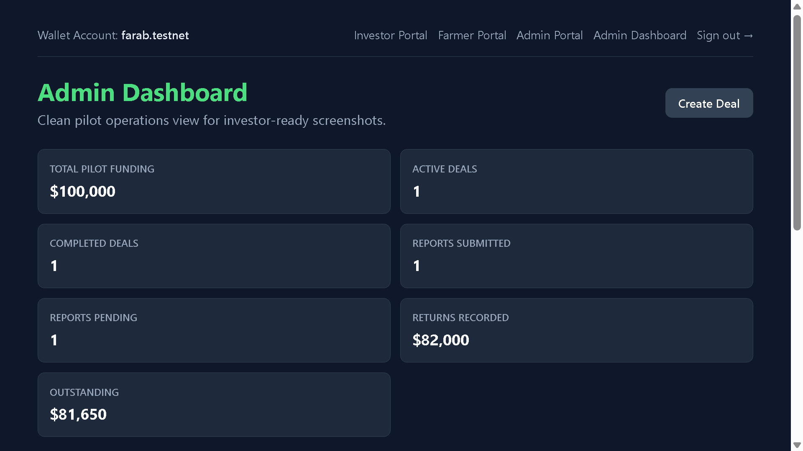
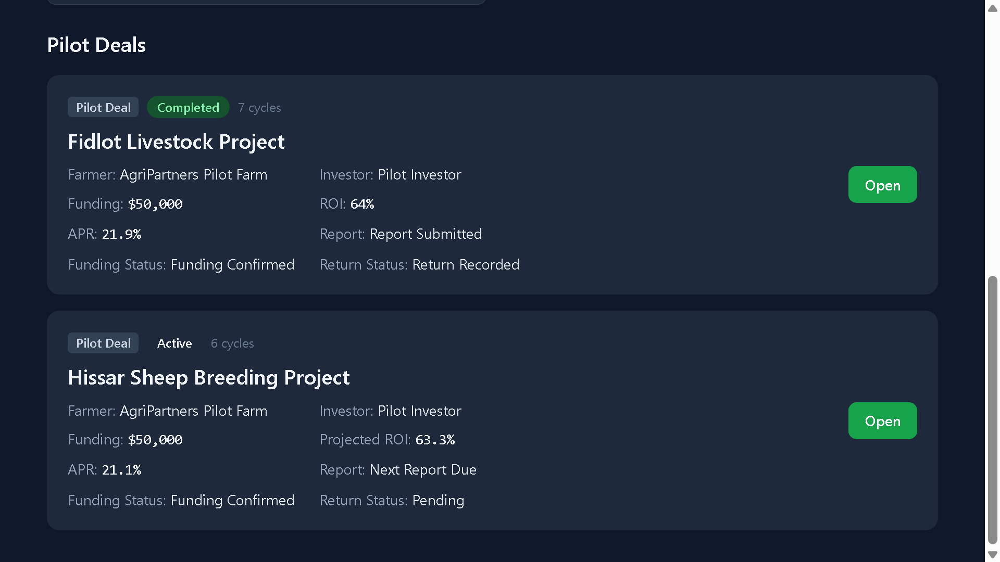
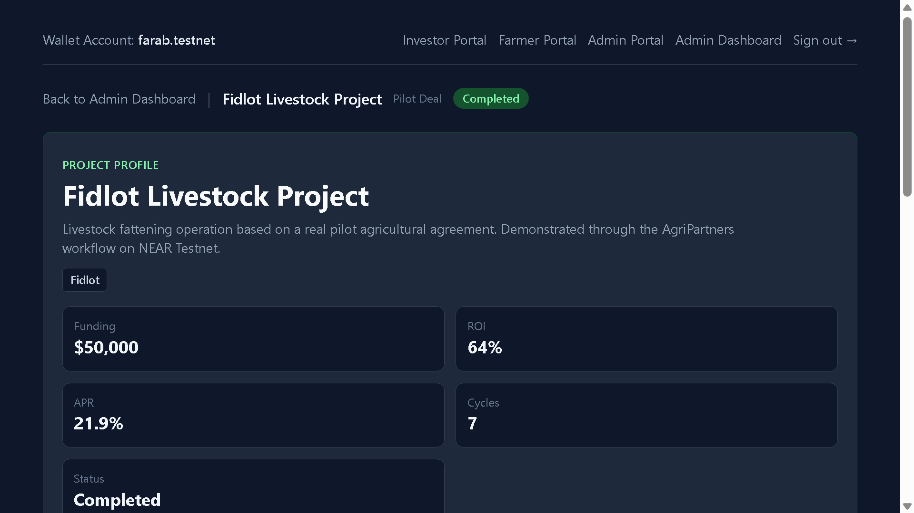
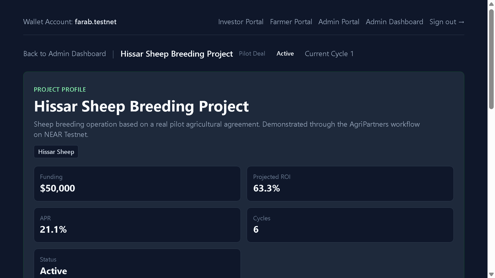
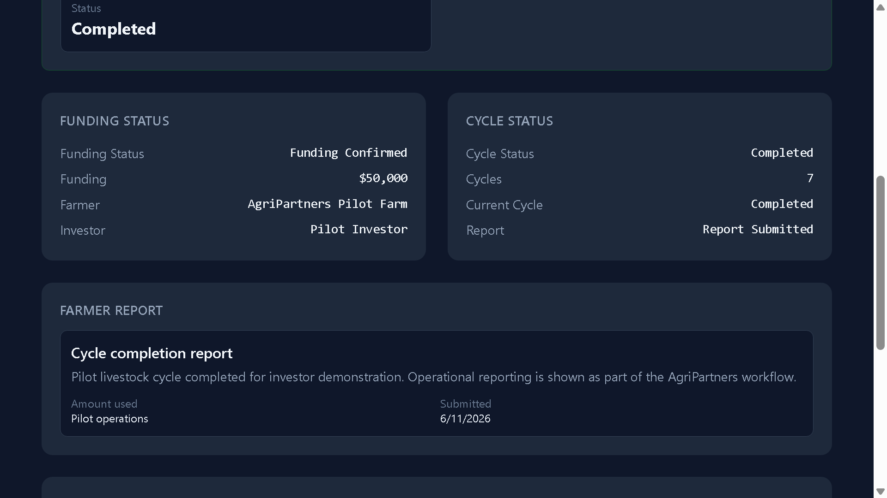
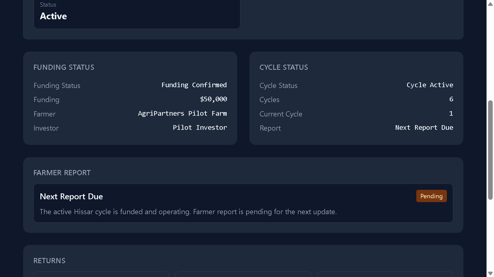
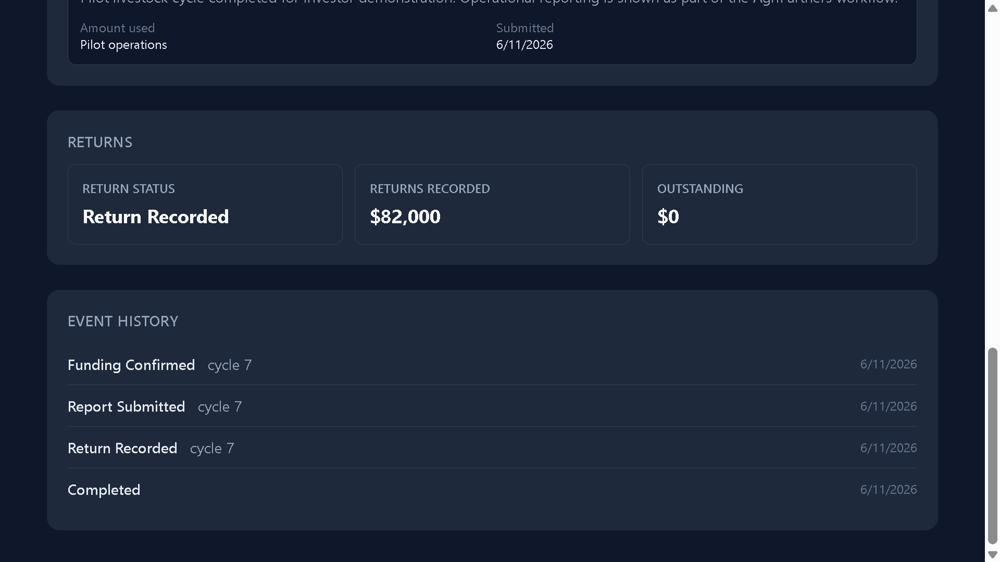
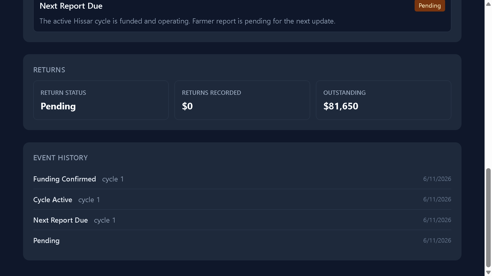

# Admin Dashboard

Admin Dashboard — операционный центр контроля пилотного портфеля. Он показывает мониторинг проектов, reporting status и repayment status без development-записей и raw technical deal names.

## Admin Dashboard

Dashboard дает администраторам чистую сводку по двум пилотам:

- Fidlot Livestock Project.
- Hissar Sheep Breeding Project.

Этот вид предназначен для investor demos, внутренних обзоров и подготовки скриншотов.

Скриншот:

## Pilot Funding Metrics

Summary cards показывают:

- Total Pilot Funding: $100,000.
- Expected Returns: $163,672.
- Active Deals: 1.
- Completed Deals: 1.
- Reports Submitted: 1.
- Reports Pending: 1.
- Returns Recorded: $82,000.
- Outstanding: $81,672.

Эти метрики показывают текущий pilot portfolio в компактном business format.

## Pilot Deals

Pilot deal cards показывают project name, status, farmer, investor, funding, ROI или Projected ROI, simple annualized ROI, report status, funding status и return status.

Скриншот:

## Deal Monitoring

У каждого пилота есть project profile с funding, ROI или Projected ROI, simple annualized ROI, cycle count и current status.

Скриншоты:

## Reporting

Admin detail view отслеживает funding и cycle status вместе с farmer report status.

Fidlot завершен и имеет Report Submitted. Hissar активен и имеет Next Report Due.

Скриншоты:

## Returns Monitoring

Admin view также отслеживает repayment state:

- Fidlot показывает Return Recorded и $82,000 returned.
- Hissar показывает Pending returns и $81,672 outstanding.

Скриншоты:

## Event History

Event history дает timeline-style view ключевых операционных событий: funding confirmation, cycle activity, report submission, return recording и completion.
