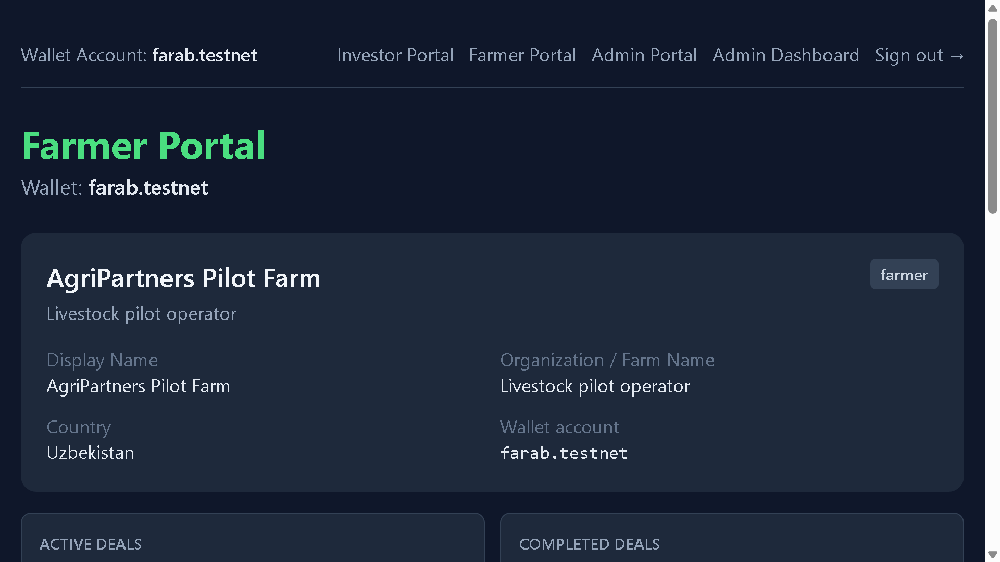
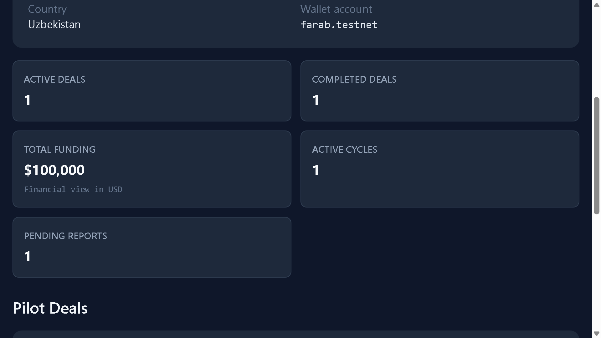
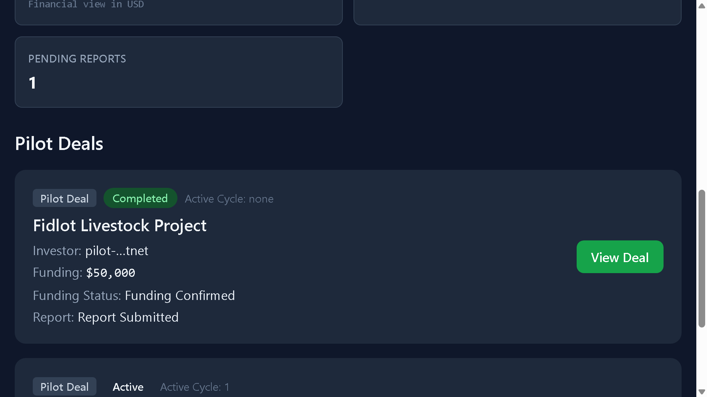
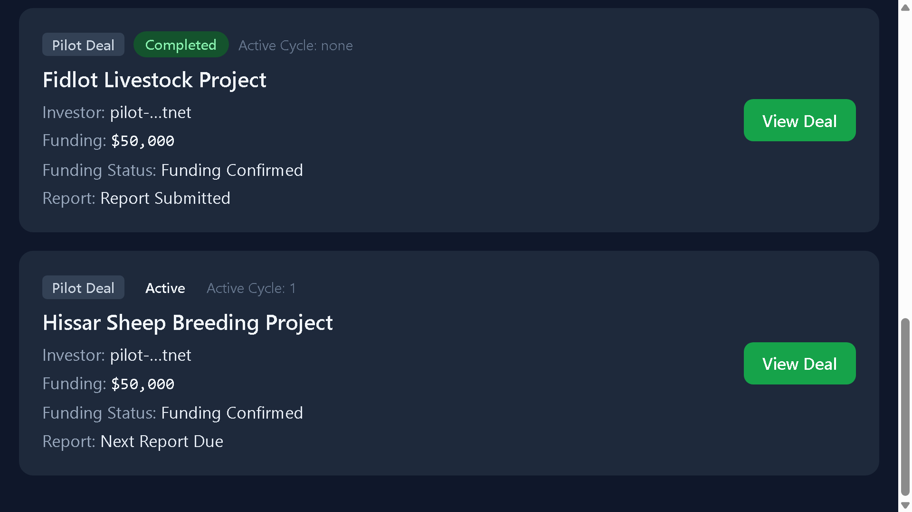

# Farmer Portal

Farmer Portal дает оператору фермы чистое представление назначенных пилотных сделок, статуса финансирования, прогресса циклов и отчетности.

## Farmer Profile

Демо-профиль представляет операционную ферму как:

- Display name: AgriPartners Pilot Farm.
- Role: farmer.
- Operator description: Livestock pilot operator.

Такой профиль помогает investor screenshots показывать фермера как реального операционного контрагента, а не тестовый wallet.

Скриншот:

## Farmer Metrics

Farmer metrics суммируют операционную нагрузку пилота:

- Active deals.
- Completed deals.
- Total funding.
- Active cycles.
- Pending reports.

В demo view финансирование показано в USD для ясности.

Скриншот:

## Funding Status

Каждая farmer deal card показывает, подтверждено ли финансирование. Для обоих пилотных проектов демо показывает Funding Confirmed, что означает готовность фермера продолжать операционный цикл.

## Cycle Tracking

Cycle tracking показывает состояние каждого проекта:

- Fidlot Livestock Project завершен.
- Hissar Sheep Breeding Project активен, идет cycle 1.

## Reports

Портал использует farmer-friendly labels:

- Report Submitted для завершенного Fidlot pilot.
- Next Report Due для активного Hissar pilot.

Скриншот:

## Active Deals

Farmer deals list показывает чистые пилотные проекты, назначенные ферме. Карточки включают project name, status, investor, funding amount, funding status и report status.

Скриншот:

