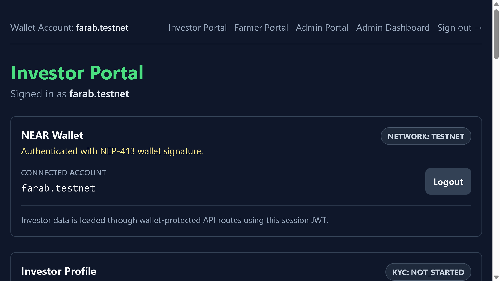
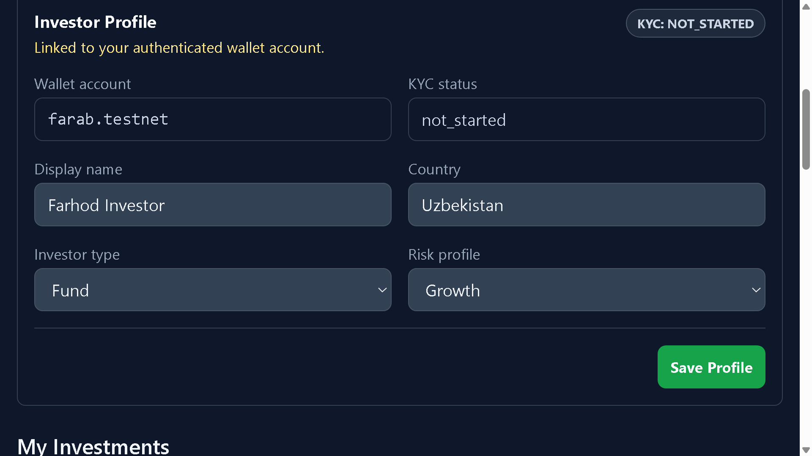
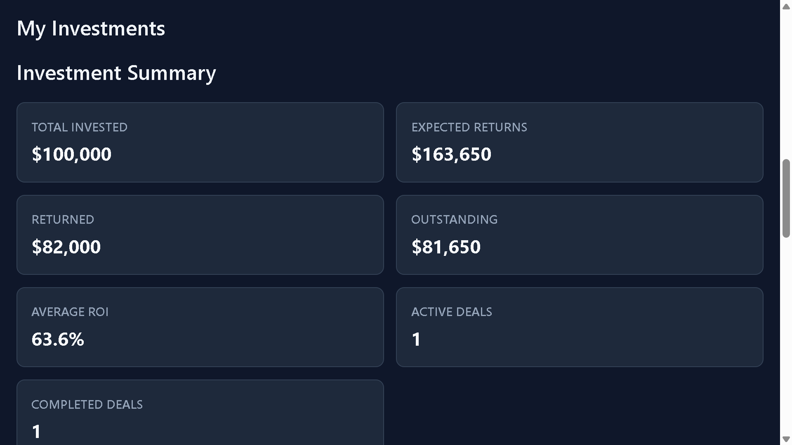
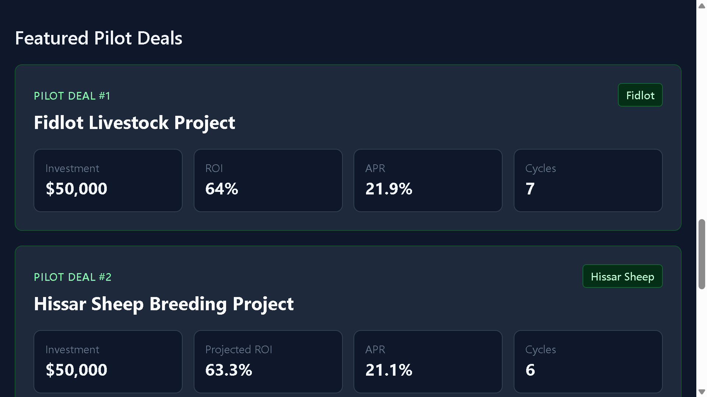
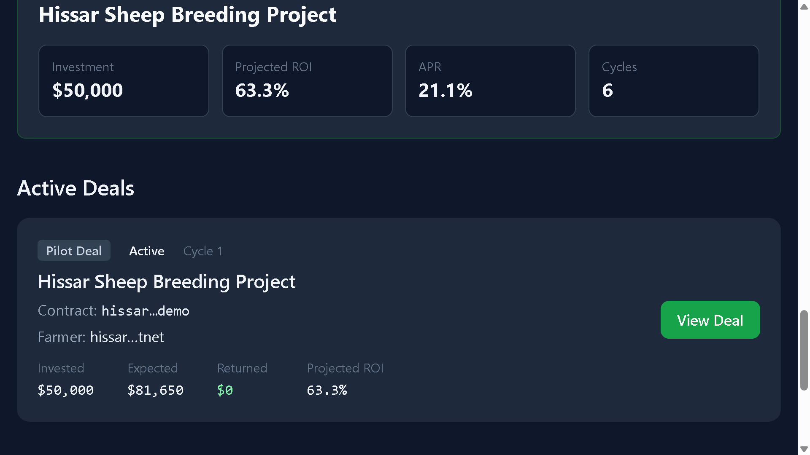
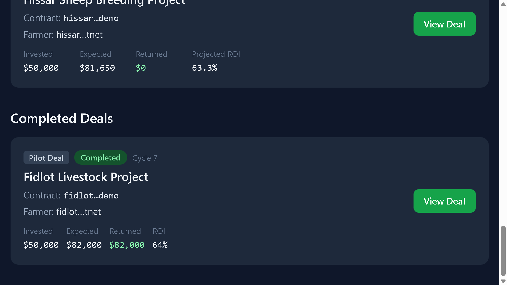

# Investor Portal

Investor Portal показывает пилотный инвестиционный портфель в формате, понятном инвесторам. Основной акцент сделан на названиях проектов, суммах финансирования, прогнозируемых и фактических возвратах, а также статусах активных и завершенных инвестиций.

## Investor Dashboard

Dashboard начинается с wallet context и блока investor profile. Это подтверждает, что пользователь авторизован, а портфельные данные загружаются через wallet-protected routes.

Скриншот:

## Investor Profile

Investor profile содержит базовую информацию об инвесторе: wallet account, display name, country, investor type, risk profile и KYC status. В демо этот блок показывает, как investor metadata связывается с wallet identity.

Скриншот:

## Investment Summary

Investment Summary дает портфельную сводку по пилотным проектам:

- общий инвестированный капитал;
- Expected Returns: $163,672;
- уже возвращенная сумма;
- outstanding amount;
- average ROI;
- количество активных и завершенных сделок.

Скриншот:

## Featured Pilot Deals

Featured Pilot Deals показывает два чистых пилотных профиля:

- Fidlot Livestock Project.
- Hissar Sheep Breeding Project.

Каждый проект показывает funding, ROI или Projected ROI, simple annualized ROI и количество циклов. Этот блок предназначен для investor discovery и быстрого сравнения пилотов.

Скриншот:

## Active Investments

Активная инвестиция представлена проектом Hissar Sheep Breeding Project. Карточка показывает invested capital, expected return, returned amount, Projected ROI, current cycle и ссылку на project detail view.

Скриншот:

## Completed Investments

Завершенная инвестиция представлена проектом Fidlot Livestock Project. Карточка показывает realized returns, completed status, cycle count и ROI.

Скриншот:

## ROI Tracking

Investor Portal различает завершенные и активные проекты:

- для завершенных проектов используется ROI;
- для активных проектов используется Projected ROI.

Так финансовые показатели остаются точными и понятными для инвесторов.

## Returns Tracking

Returns tracking показывает, как завершенные проекты фиксируют возвращенный капитал, а активные проекты показывают outstanding expected returns. В демо Fidlot показывает recorded returns, а Hissar остается outstanding.

